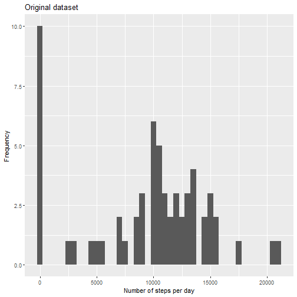
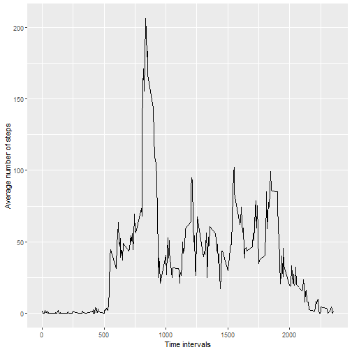
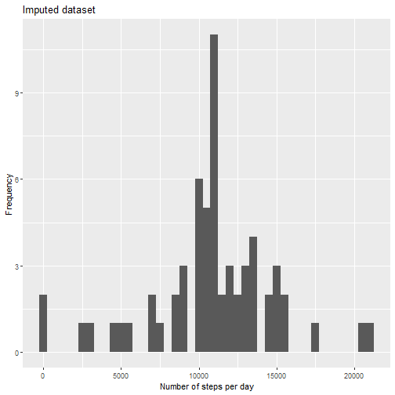
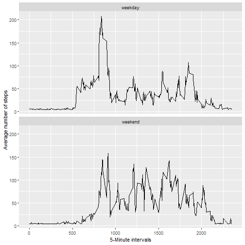

## Loading and preprocessing the data

``` r
unzip("activity.zip")
df <- read.csv("activity.csv")
```

## What is mean total number of steps taken per day?

1. Analysis of total steps per day

``` r
daily_steps <- df %>% 
group_by(date) %>% 
summarise(steps_per_day = sum(steps, na.rm = TRUE))
```

2. Histogram of daily plots

``` r
ggplot(daily_steps,
       aes(steps_per_day)) +
  geom_histogram(binwidth=500) + 
  xlab("Number of steps per day") +
  ylab("Frequency") +
  ggtitle("Original dataset")
```




3. The mean and median of the total number of steps taken per day

``` r
summary(daily_steps)
```

```
##      date           steps_per_day  
##  Length:61          Min.   :    0  
##  Class :character   1st Qu.: 6778  
##  Mode  :character   Median :10395  
##                     Mean   : 9354  
##                     3rd Qu.:12811  
##                     Max.   :21194
```

## What is the average daily activity pattern?

1. Analysis of mean steps per interval

``` r
interval_steps <- df %>% 
group_by(interval) %>% 
summarise(steps_per_interval = mean(steps, na.rm = TRUE))
```

2. Time series plot

``` r
ggplot(data = interval_steps,
       aes(x = interval,
           y = steps_per_interval)) +
  geom_line() +
  xlab("Time intervals") +
  ylab("Average number of steps")
```




3. Interval with maximum number of steps

``` r
interval_steps %>%
  arrange(desc(steps_per_interval)) %>% 
  head(n=1)
```

```
## # A tibble: 1 × 2
##   interval steps_per_interval
##      <int>              <dbl>
## 1      835               206.
```
## Imputing missing values
1. Analysis of missing data

``` r
lapply(df, function(x) sum(is.na(x)))
```

```
## $steps
## [1] 2304
## 
## $date
## [1] 0
## 
## $interval
## [1] 0
```
2. Imputing missing values by its mean

``` r
df_imputed <- df
df_imputed$steps[is.na(df_imputed$steps)] <- mean(df_imputed$steps, na.rm = TRUE)
```


3. Analysis of total steps per day in imputed data

``` r
daily_steps_imputed <- df_imputed %>% 
group_by(date) %>% 
summarise(steps_per_day = sum(steps))
```

4. Histogram of daily plots based on imputed dataset

``` r
ggplot(daily_steps_imputed,
       aes(steps_per_day)) +
  geom_histogram(binwidth=500) + 
  xlab("Number of steps per day") +
  ylab("Frequency") +
  ggtitle("Imputed dataset")
```




5. Comparison of mean and median number of steps in original and imputed dataset

Original dataset:

``` r
library(broom)
summary_original_df <- daily_steps$steps_per_day %>%
  summary() %>%
  tidy()
```

```
## Warning in tidy.summaryDefault(.): `tidy.summaryDefault()` is
## deprecated. Please use `skimr::skim()` instead.
```

``` r
summary_original_df
```

```
## # A tibble: 1 × 6
##   minimum    q1 median  mean    q3 maximum
##     <dbl> <dbl>  <dbl> <dbl> <dbl>   <dbl>
## 1       0  6778  10395 9354. 12811   21194
```
Imputed dataset:

``` r
summary_imputed_df <- daily_steps_imputed$steps_per_day %>%
  summary() %>%
  tidy()
```

```
## Warning in tidy.summaryDefault(.): `tidy.summaryDefault()` is
## deprecated. Please use `skimr::skim()` instead.
```

``` r
print(summary_imputed_df)
```

```
## # A tibble: 1 × 6
##   minimum    q1 median   mean    q3 maximum
##     <dbl> <dbl>  <dbl>  <dbl> <dbl>   <dbl>
## 1      41  9819 10766. 10766. 12811   21194
```


``` r
summary_imputed_df$mean - summary_original_df$mean
```

```
## [1] 1411.959
```
Mean of imputed data is higher by ~1412 steps than mean of original data


``` r
summary_imputed_df$median - summary_original_df$median
```

```
## [1] 371.1887
```
Median of imputed data is higher by ~371 steps than median of original data

In conclusion imputation eliminated missing steps data and in consequence lead to increase of number of steps.


## Are there differences in activity patterns between weekdays and weekends?

1. Preparing new variable

``` r
library(lubridate)

df_imputed$date <- as.Date(df_imputed$date)
df_imputed$weekday_type <- ifelse(wday(df_imputed$date, week_start = 1) >= 6, "weekend", "weekday")

df_imputed <- df_imputed %>% 
  group_by(interval, weekday_type) %>% 
  summarise(mean_steps = mean(steps))
```

```
## `summarise()` has grouped output by 'interval'. You can override
## using the `.groups` argument.
```

2. Preparing the plot

``` r
ggplot(df_imputed, aes(interval, mean_steps)) + 
  geom_line() + 
  facet_wrap(~weekday_type, nrow = 2) +
  xlab("5-Minute intervals") + 
  ylab("Average number of steps")
```


Weekdays have a more intense mornings, while steps over the weekend are more balanced
